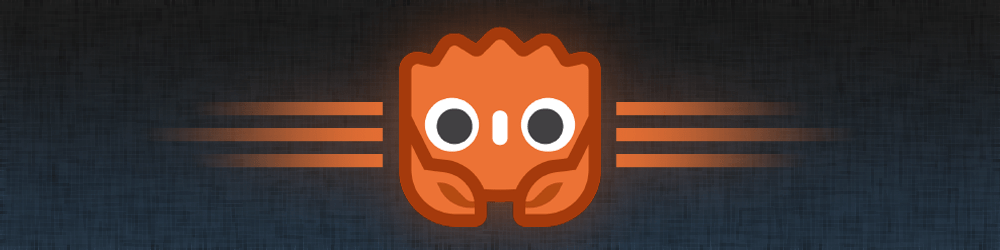

# Rust bindings for Godot 4

_**[Website]** | **[Book][book]** | **[API Docs]** | [Discord] | [Mastodon] | [Twitter] | [Sponsor]_

**gdext** is a library to integrate the Rust language with Godot 4.

[Godot] is an open-source game engine, focusing on a productive and batteries-included 2D and 3D experience.  
Its _GDExtension_ API allows integrating third-party languages and libraries.

Rust bindings for Godot 3 (GDNative API) are available in [`gdnative`].

## Philosophy

The Rust binding is an alternative to GDScript, with a focus on type safety, scalability and performance.

The primary goal of gdext is to provide a [**pragmatic Rust API**][philosophy] for game developers.

Recurring workflows should be simple and require minimal boilerplate. APIs are designed to be safe and idiomatic Rust wherever possible.
Due to interacting with Godot as a C++ engine, we sometimes follow unconventional approaches to provide a good user experience.

## Development status

The gdext library has evolved a lot during 2023 and 2024 and is now in a usable state for smaller projects.
However, there are still certain things to keep in mind.

> [!WARNING]  
> The public API introduces breaking changes from time to time, primarily motivated by new features and improved ergonomics.
> Our [crates.io releases][crates-io] adhere to SemVer, but may lag behind the `master` branch. See also [API stability] in the book.

**Features:** Most Godot APIs have been mapped at this point. The current focus lies on a more natural Rust experience and enable more design
patterns that come in handy for day-to-day game development. See [#24] for an up-to-date feature overview.

At the moment, there is experimental support for [Wasm], [Android] and [iOS], but documentation and tooling is still lacking. Contributions are very welcome!

**Bugs:** Most undefined behavior related to the FFI layer has been ironed out, but there may still be occasional safety issues. Apart from that,
new additions to the library are typically not feature-complete from the start, but become more robust with feedback and testing over time.
To counter bugs, we have an elaborate CI suite including clippy, unit tests, engine integration tests and memory sanitizers. Even hot-reload is tested!

## Getting started

To dive into Rust development with gdext, check out [the godot-rust book][book]. The book is still under construction,
but already covers a _Hello World_ setup as well as several more in-depth chapters.

To consult the API reference, have a look at the online [API Docs].

Furthermore, we provide some practical examples and small games in the [demo-projects] repository.

If you need help, join our [Discord] server and ask in the `#help` channel!

## License

We use the [Mozilla Public License 2.0][mpl]. MPL tries to find a balance between permissive (MIT, Apache, Zlib) and copyleft licenses (GPL, LGPL).

The license provides a lot of freedom: you can use the library commercially and keep your own code closed-source,
i.e. game development is not restricted. The main condition is that if you change gdext _itself_, you need to make
those changes available (and only those, no surrounding code).

## Contributing

Contributions are very welcome! If you want to help out, see [`Contributing.md`](Contributing.md) for some pointers on getting started.

[#24]: https://github.com/godot-rust/gdext/issues/24
[API Docs]: https://godot-rust.github.io/docs/gdext
[API stability]: https://godot-rust.github.io/book/toolchain/compatibility.html#rust-api-stability
[Android]: https://github.com/godot-rust/gdext/issues/470
[Discord]: https://discord.gg/aKUCJ8rJsc
[Godot]: https://godotengine.org
[Mastodon]: https://mastodon.gamedev.place/@GodotRust
[Sponsor]: https://github.com/sponsors/Bromeon
[Twitter]: https://twitter.com/GodotRust
[WASM]: https://godot-rust.github.io/book/toolchain/export-web.html
[Website]: https://godot-rust.github.io
[`gdnative`]: https://github.com/godot-rust/gdnative
[book]: https://godot-rust.github.io/book
[demo-projects]: https://github.com/godot-rust/demo-projects
[iOS]: https://github.com/godot-rust/gdext/issues/498
[mpl]: https://www.mozilla.org/en-US/MPL
[philosophy]: https://godot-rust.github.io/book/contribute/philosophy.html
[crates-io]: https://crates.io/crates/godot